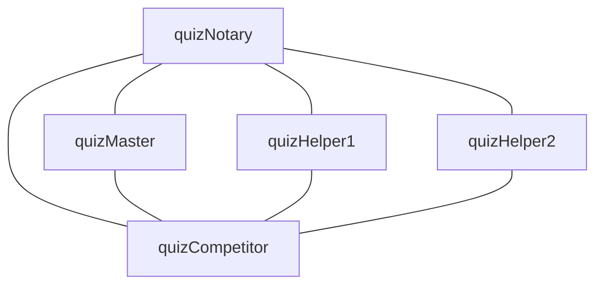

# Trivia Quiz MAS
This repository implements a MAS that plays a trivia quiz game. The implementation has been developed in DALIA, which is an extension of the [DALI](https://github.com/AAAI-DISIM-UnivAQ/DALI) logic programming language also providing a GUI.
Before proceeding in this README, notice that this is divided in the following subsections, each dicussing an important either of the design, of the implentation or of how to run the MAS on your PC.

- Project Idea and Detailed Specification.
- MAS Design according to GAIA Methodology.
- How to Install and Run the MAS.

## 1. Project Idea and Detailed Specification
Define a MAS in which there is an agent, representing a trivia quiz master, asking questions to multiple other agents which are competitors that try to win the quiz. Other than these, there are also helper agents which can all be invoked once per game from each competitor, and finally there is a quiz notary that keeps track dynamically of participants to the game, their points and who wins.

The master should be able to select random questions in a pool of pre-defined ones, to ask questions to competitors and to check if the answer is correct.

The competitors should be able to randomly answer questions they get, and are also able to use hints from external agents. In particular, they have two types of hints: one instantly gives the correct answer and the other reduces the number of possible answers from four to two. Moreover, to be able to participate, they must send a participation message to the notary as soon as they wake up.

The notary keeps track of participants to the game, of their points and determines when the game is finished, decreeing the winner. Moreover, it is responsible for skipping a question if the answers do not come within a pre-defined time interval, and to end the game if it is taking too long. Note that this agent starts the quiz as soon as a fixed minimum of participants joins the game.

Finally, note that each competitor waits a random amount time in the following two different situations.

- When answering, in order to simulate a thinking process, and the fact that answers are considered in the order they come.
- When sending the participation message, in order to introduce the possibility for later participants to still join the game, having the penalty of have been not able to answer previous questions.

## 2. MAS Design according to GAIA Methodology
GAIA metholody is followed, according to what's written on the paper written to present it and discuss all its details, and available at this [link](https://link.springer.com/article/10.1023/A:1010071910869).

### 2.1 Analysis Phase
The first phase is the analysis phase, which is in turn divided into two major sub-phases: the roles identification and the protocols identification. Both are discussed here below.

#### 2.1.1 Roles Identification

| **Role Schema:** | QuizNotary |
|---|---|
| **Description:** | The notary accepts participants to the game, starts the game, keeps track of participants' points and determines when the game is finished, decreeing the winner. It also skips questions or ends the game if elapsed time is higher than pre-defined thresholds. Finally, it keeps track of participants' available hints, and is their interface for them to ask any hint.|
| **Protocols and Activities:** | updateParticipants, updatePoints, startGame, checkWin, endGame, skipQuestion, askHelp |
| **Permissions:** | |
| reads | *Participants* // List of names of participants to the game |
| | *Players points* // Points associated to each participant |
| | *Available hints* // Hints still available for each participant |
| | *Game Time* // Time elapsed from the start of the game |
| | *Question Time* // Time elapsed from the start of the current question |
| | *Game State* // Current state of the game. It can be waiting, running or finished |
| changes | *Players points* // Points associated to each participant |
| | *Available hints* // Hints still available for each participant |
| | *Game State* // Current state of the game. It can be waiting, running or finished |
| **Responsibilities** | |
| **Liveness:** | |
| | QuizNotary = (updateParticipants. startGame. updatePoints. skipQuestion*. askHelp*. checkWin. endGame)^ω |
| **Safety:** | |
| | • *Player's Points* ≥ 0 |
| | • *Player's* ≤ *Winning Threshold* |
| | • *Game Duration* ≤ *Pre-defined Threshold* |
| | • *Question Duration* ≤ *Pre-defined Threshold* |

| **Role Schema:** | QuizMaster |
|---|---|
| **Description:** | The master selects random questions from a pool of pre-defined ones, asks questions to competitors and checks if the answer is correct. It also orders points updates, informs competitors when game ends and asks for a new question when all participants give a wrong answer. |
| **Protocols and Activities:** | askQuestion, checkAnswer, notifyAnswerOutcome, nextQuestion, notifyGameEnd, notifyPointsIncrease |
| **Permissions:** | |
| reads | **supplied** *Participants* // List of participants to the game |
| | **supplied** *Game State* // Current state of the game. It can be waiting, running or finished |
| | *Available Questions* // Pool of pre-defined questions |
| | *Available Answers* // Pool of pre-defined answers |
| | *Correct Answers* // Correct answer for each question |
| | *Current Answered* // Players who already tried to answer the current question |
| changes | *Available Questions* // Pool of remaining questions after a selection |
| | *Current Answered* // Players who already tried to answer the current question |
| generates | *Question* // Selected question to ask and relative possible answers|
| **Responsibilities** | |
| **Liveness:** | |
| | QuizMaster = (askQuestion. checkAnswer. notifyAnswerOutcome. (notifyPointsIncrease. | nextQuestion). notifyGameEnd)^ω |
| **Safety:** | |
| | • *Remaining Available Questions* ≥ 0 |
| | • *Correct Answer per Question* = 1 |
| | • *Available Answers per Question* = *Pre-defined Number* |
| | • *Current Answered* ≤ *Number of Participants* |

| **Role Schema:** | QuizCompetitor |
|---|---|
| **Description:** | The competitor participates in the quiz by joining the game, receiving questions, thinking about answers and giving responses. It can use hints from external helper agents and reacts to answer outcomes. Each competitor must send a participation message to the notary to join. Finally, it reacts to game outcome when game ends. |
| **Protocols and Activities:** | joinGame, answerQuestion, askForHelp, reactAnswerOutcome, reactGameOutcome |
| **Permissions:** | |
| reads | **supplied** *Available Answers* // Set of possible answers for current question |
| | *Available hints* // Hints still available to the participant |
| | **supplied** *Game State* // Current state of the game. It can be waiting, running or finished |
| changes | *Available Answers* // Possible answers modified by hints |
| generates | *Answer* // Selected answer to the question |
| **Responsibilities** | |
| **Liveness:** | |
| | QuizCompetitor = (joinGame. (askForHelp. giveAnswer. reactAnswerOutcome)*. reactGameOutcome)^ω |
| **Safety:** | |
| | • *Available Answers* ≥ 0 |
| | • *Participation to Game* = 1 |
| | • *Answer* ∈ *Set of Available Answers* |

| **Role Schema:** | Helper1 |
|---|---|
| **Description:** | This helper receives hint requests from competitors and instantly provides the correct answer. It can be invoked once per game by each competitor. |
| **Protocols and Activities:** | determineCorrectAnswer, receiveHintRequest, respondWithCorrectAnswer |
| **Permissions:** | |
| reads | *Correct Answers* // Correct answer for each question |
| | **supplied** *Game State* // Current state of the game. It can be waiting, running or finished |
| generates | *Correct Answer* // The correct answer to provide |
| **Responsibilities** | |
| **Liveness:** | |
| | Helper1 = (receiveHintRequest. determineCorrectAnswer. respondWithCorrectAnswer)^ω |
| **Safety:** | |
| | • *Correct Answer* is always available |

| **Role Schema:** | Helper2 |
|---|---|
| **Description:** | This helper receives hint requests from competitors and reduces the possible answers from four to two by eliminating two wrong answers. It can be invoked once per game by each competitor. |
| **Protocols and Activities:** | determineRemainingAnswers, receiveHintRequest, respondWithRemainingAnswers |
| **Permissions:** | |
| reads | *Correct Answers* // Correct answer for each question |
| | **supplied** *Available Answers* // Set of possible answers for current question |
| | **supplied** *Game State* // Current state of the game. It can be waiting, running or finished |
| changes | *Available Answers* // Reduced set of possible answers |
| generates | *Remaining Answers* // Two remaining answers after elimination |
| **Responsibilities** | |
| **Liveness:** | |
| | Helper2 = (receiveHintRequest. determineRemainingAnswers. respondWithRemainingAnswers)^ω |
| **Safety:** | |
| | • *Remaining Answers* > 0 |
| | • *Number of Remaining Answers* = *Pre-defined Number* |

#### 2.1.2 Protocols Identification

| **Protocol:** | Join Game |
|---|---|
| **Initiator:** | Quiz Participant |
| **Responder:** | Quiz Notary |
| **Inputs:** | Participant name |
| **Outputs:** | Notary confirmation message |
| **Processing:** | Add participant name to participants list |
| **Description:** | Quiz participant informs quiz notary that he wants to be included in the next game. |

| **Protocol:** | Start Game |
|---|---|
| **Initiator:** | Quiz Notary |
| **Responder:** | All quiz agents |
| **Inputs:** | Participants list |
| **Outputs:** | Changed game state |
| **Processing:** | Master, helpers and participants change game state to running |
| **Description:** | Quiz notary informs all agents involved in the game that minimum number of participants has been reached, and so that the game is starting. |

| **Protocol:** | End Game |
|---|---|
| **Initiator:** | Quiz Notary |
| **Responder:** | All quiz agents |
| **Inputs:** | Winner name or Game duration |
| **Outputs:** | Changed game state and participants reactions |
| **Processing:** | Master, helpers and participants change game state to finished |
| **Description:** | Quiz notary informs all agents involved in the game that the game has ended, either because someone reached the winning threshold or because the maximum duration has been reached. If there is a winner, participants react to the game outcome |

| **Protocol:** | Notify Answer Outcome |
|---|---|
| **Initiator:** | Quiz Master |
| **Responder:** | Quiz Participant |
| **Inputs:** | Answer correctness |
| **Outputs:** | Participant reaction |
| **Processing:** | Master checks whether the answer is correct or not |
| **Description:** | Quiz master checks whether provided answer is correct or not and returns to the agent the outcome. Depending on this last participant reacts celebrating or waiting for next question |

| **Protocol:** | Notify Points Increase |
|---|---|
| **Initiator:** | Quiz Master |
| **Responder:** | Quiz Notary |
| **Inputs:** | Participant name |
| **Outputs:** | Participant points |
| **Processing:** | Notary increases the points of the participant |
| **Description:** | Quiz notary increases by one the points of the participant associated with the provided participant name |

| **Protocol:** | Ask Question |
|---|---|
| **Initiator:** | Quiz Notary |
| **Responder:** | Quiz Master and Participants |
| **Inputs:** | List of participants |
| **Outputs:** | Participants answers |
| **Processing:** | Master generates a question and participants generate their answers |
| **Description:** | Quiz notary asks the master to answer the next question providing the current list of participants. The master generates the question, with associated possible answers, and delivers it to participants. Finally, participants choose an answer which is returned to the master. |

| **Protocol:** | Ask for Hint 1 |
|---|---|
| **Initiator:** | Quiz Participant |
| **Responder:** | Quiz Notary and Quiz Helper 1 |
| **Inputs:** | Current Question |
| **Outputs:** | Correct Answer |
| **Processing:** | Helper determines correct answer and notary deletes type 1 hint availability |
| **Description:** | Quiz participant asks the notary to use its type 1 hint for the current question. Notary invokes the helper, which returns the correct answer to the participant. |

| **Protocol:** | Ask for Hint 2 |
|---|---|
| **Initiator:** | Quiz Participant |
| **Responder:** | Quiz Notary and Quiz Helper 2 |
| **Inputs:** | Current Question and Answers |
| **Outputs:** | Reduced Answers |
| **Processing:** | Helper determines reduced answers and notary deletes type 2 hint availability |
| **Description:** | Quiz participant asks the notary to use its type 2 hint for the current question. Notary invokes the helper, which returns the reduced set of possible answers to the participant |

### 2.2 Design Phase
The second phase is the design phase, which consists in defining three models for the system: the agent model, the services model and acquaintance model. All are discussed here below.

#### 2.2.1 Agent Model

- **Agent Types**
    - One Type for each Role

- **Agent Instances**
    - **Quiz Notary**: 1
    - **Quiz Master**: 1
    - **Quiz Helper 1**: 1
    - **Quiz Helper 2**: 1
    - **Quiz Competitor**: +

#### 2.2.2 Services Model
| Service | Inputs | Outputs | Pre-condition | Post-condition |
|---|---|---|---|---|
| Update Participants | Participant name | Updated participants list | Participant name $\notin$ participants list | Participant name ∈ participants list |
| Update Points | Participant Name | Updated points | Participant name ∈ participants list ∧ game state = running | Participant points = previous points + 1 |
| Update Hint Availability | Participant name, hint type | Updated hint availability | Participant has hint of requested type available | Hint of requested type no longer available |
| Check Win | Participants points | Winner name or nil | Game state = running | (Winner found ∧ winner points ≥ winning threshold) ∨ winner = nil |
| Skip Question | Current question time | Question skipped signal | Current question time ≥ pre-defined threshold | aster receives signal to ask next question |
| Choose Question | Available questions | Selected question, available answers | Remaining available questions > 0 ∧ game state = running | Question ∉ available questions ∧ available answers per question = pre-defined number |
| Check Answer | Participant answer | Answer correctness (true/false) | Answer ∈ set of available answers ∧ game state = running | (Update points ∨ Wrong Answer) ∧ Current Answered = true |
| Choose Answer | Available answers | Selected answer | Available answers > 0 ∧ game state = running | Selected answer ∈ available answers |
| Determine Correct Answer | Current question | Correct answer | Correct answer is available ∧ game state = running | Returned answer = correct answer |
| Determine Remaining Answers | Current question, available answers, correct answer | Reduced set of answers | Available answers = pre-defined number ∧ game state = running | Remaining answers = pre-defined number ∧ correct answer ∈ remaining answers |

#### 2.2.3 Acquaintance Model


## 3. Install and Run MAS
The MAS runs on [DALIA](https://github.com/AAAI-DISIM-UnivAQ/dalia), which is a containerized launcher with a GUI for multi-agent-systems written in [DALI](https://github.com/AAAI-DISIM-UnivAQ/DALI). Then, to run the MAS, check if pre-requisites are satisfied and then follow the steps below. 

### Pre-Requisites:

1. Install SICStus from this [link](https://sicstus.sics.se/).
2. Clone the [DALI](https://github.com/AAAI-DISIM-UnivAQ/DALI) repository and follow instructions to install DALI.
3. Install Docker from this [link](https://docs.docker.com/engine/install/).

### Install and Run the MAS

1. Clone this repository.
2. Navigate into cloned repository.
3. Open Docker Desktop.
4. Run the following command.
    ```sh
    ./run --sicstus <path_to_sicstus_directory> --dali <path_to_dali_directory> --src ./quiz
    ```

--- 
## Credits
This project was developed using DALIA and all the agents are written in DALI language. References to both repositories is provided here below.

- DALIA repository is available at: https://github.com/AAAI-DISIM-UnivAQ/dalia.
- DALI repository is available at: https://github.com/AAAI-DISIM-UnivAQ/DALI.

Both repositories are developed by UNIVAQ's DISIM: https://www.disim.univaq.it.

### Additions of this Fork
In this fork just the files implementing and describing the MAS have been added, which are the following.
- `quiz` folder.
- `Quiz MAS Class Diagram`.
- `Quiz MAS Sequence Diagram`.